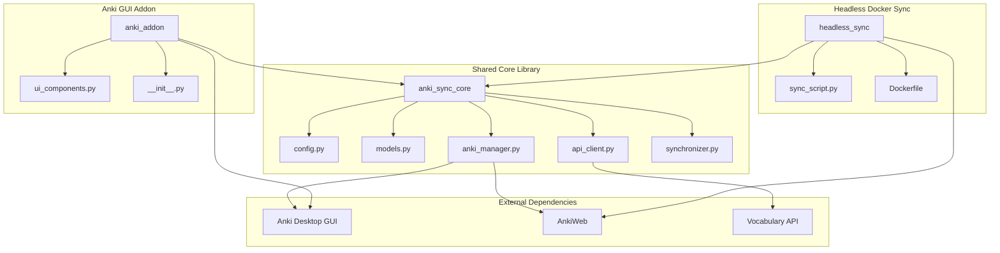

# Anki Vocabulary Sync - Restructuring Plan

## Overview

This document outlines the restructuring plan to integrate `headless_anki_sync` into `anki_voc` with a clean, modular architecture using a shared core library.

## Current Issues

1. **Path Bug**: `headless_anki_sync/sync_script.py` imports from `anki_addon` but the actual directory is `anki_voc`
2. **Mixed Concerns**: `anki_voc/` contains both GUI-dependent code and headless-compatible code
3. **Duplicated Configuration**: Config split between `addon_config.py` and environment variables
4. **No Clear Separation**: Core logic is tightly coupled with Anki GUI components
5. **Inconsistent Structure**: Two separate directories with overlapping functionality

## Proposed Architecture

### New Directory Structure

```
anki_addon/
├── anki_sync_core/              # Shared core library (no GUI dependencies)
│   ├── __init__.py
│   ├── config.py                # Unified configuration management
│   ├── models.py                # Data models (FlashCard, CardResult)
│   ├── api_client.py            # Vocabulary API client
│   ├── anki_manager.py          # Anki collection operations
│   └── synchronizer.py          # Core synchronization logic
│
├── anki_addon/                  # Anki GUI addon (uses core library)
│   ├── __init__.py              # Addon initialization and menu setup
│   └── ui_components.py         # GUI dialogs and components
│
├── headless_sync/               # Headless Docker sync (uses core library)
│   ├── sync_script.py           # Headless synchronization script
│   ├── Dockerfile
│   ├── docker-compose.yml
│   ├── .env.example
│   └── README.md
│
├── tests/                       # Shared tests for core library
│   ├── __init__.py
│   ├── test_api_client.py
│   ├── test_anki_manager.py
│   └── test_synchronizer.py
│
├── README.md                    # Main project README
├── LICENSE                      # License file
└── .gitignore
```

### Architecture Diagram



### Component Responsibilities

#### `anki_sync_core/` - Shared Core Library
- **Purpose**: Contains all business logic without any GUI dependencies
- **Dependencies**: Only `anki` (pylib), `requests`, standard library
- **Components**:
  - `config.py`: Unified configuration with support for both file-based and env-based config
  - `models.py`: Data models (FlashCard, CardResult)
  - `api_client.py`: VocabularyAPIClient for HTTP communication
  - `anki_manager.py`: AnkiCardManager for collection operations
  - `synchronizer.py`: FlashcardSynchronizer for coordination

#### `anki_addon/` - Anki GUI Addon
- **Purpose**: Provides GUI integration for Anki Desktop
- **Dependencies**: `anki_sync_core`, Anki Qt (`aqt`)
- **Components**:
  - `__init__.py`: Addon initialization, menu setup, operation creation
  - `ui_components.py`: Dialogs for displaying results and errors

#### `headless_sync/` - Headless Docker Sync
- **Purpose**: Provides automated, scheduled synchronization without GUI
- **Dependencies**: `anki_sync_core`, Docker, cron
- **Components**:
  - `sync_script.py`: Main script for headless synchronization
  - `Dockerfile`: Container definition
  - `docker-compose.yml`: Docker Compose configuration
  - `.env.example`: Environment variable template

## Migration Steps

### Step 1: Create New Directory Structure
- Create `anki_sync_core/` directory
- Create `anki_addon/` directory (rename from `anki_voc/`)
- Create `headless_sync/` directory (rename from `headless_anki_sync/`)
- Create `tests/` directory

### Step 2: Extract Core Logic
- Move `anki_voc/models.py` → `anki_sync_core/models.py`
- Move `anki_voc/vocabulary_api.py` → `anki_sync_core/api_client.py`
- Move `anki_voc/anki_operations.py` → `anki_sync_core/anki_manager.py`
- Move `anki_voc/synchronizer.py` → `anki_sync_core/synchronizer.py`
- Create new `anki_sync_core/config.py` with unified configuration

### Step 3: Refactor Core Library
- Remove all GUI dependencies from core modules
- Update imports to use new package structure
- Ensure all core modules can be imported independently
- Add proper `__init__.py` for package exports

### Step 4: Update Anki Addon
- Move `anki_voc/__init__.py` → `anki_addon/__init__.py`
- Move `anki_voc/ui_components.py` → `anki_addon/ui_components.py`
- Update imports to use `anki_sync_core`
- Remove `addon_config.py` (use core config instead)
- Update menu setup and operation creation

### Step 5: Update Headless Sync
- Move `headless_anki_sync/sync_script.py` → `headless_sync/sync_script.py`
- Fix path bug (import from `anki_sync_core` instead of `anki_addon`)
- Update imports to use `anki_sync_core`
- Update Dockerfile to copy new directory structure
- Update docker-compose.yml environment variables

### Step 6: Consolidate Configuration
- Create unified `anki_sync_core/config.py` with:
  - Support for environment variables
  - Support for configuration files
  - Default values
  - Validation
- Remove `anki_voc/addon_config.py`
- Update `.env.example` to reference new config structure

### Step 7: Update Docker Configuration
- Update `Dockerfile` to copy `anki_sync_core` instead of `anki_addon`
- Update volume mounts for new structure
- Update environment variable references

### Step 8: Update Documentation
- Create comprehensive `README.md` for main project
- Update `headless_sync/README.md` for new structure
- Add documentation for `anki_sync_core` API
- Update installation and usage instructions

### Step 9: Clean Up
- Remove old `anki_voc/` directory
- Remove old `headless_anki_sync/` directory
- Remove any temporary files
- Update `.gitignore` if needed

## Configuration Management

### Unified Configuration (`anki_sync_core/config.py`)

```python
import os
from dataclasses import dataclass
from typing import Optional

@dataclass
class SyncConfig:
    """Unified configuration for Anki sync operations."""

    # API Configuration
    api_base_url: str = "http://backend.home-lab.com"
    flashcards_endpoint: Optional[str] = None  # Computed from api_base_url

    # Anki Configuration
    default_model_name: str = "Einfach"
    anki_field_front: str = "Vorderseite"
    anki_field_back: str = "Rückseite"
    anki_field_description: str = "Description"

    # AnkiWeb Configuration (for headless sync)
    anki_username: Optional[str] = None
    anki_password: Optional[str] = None

    # Collection Configuration (for headless sync)
    collection_path: Optional[str] = None

    # Schedule Configuration (for headless sync)
    schedule: str = "0 */6 * * *"

    # UI Configuration (for GUI addon)
    window_title_changed_cards: str = "Changed Cards"
    window_title_error: str = "Synchronization Error"
    window_minimum_size: tuple = (400, 300)
    menu_action_text: str = "Import cards from server"

    # Logging
    log_no_cards_created: str = "No card was created (possible duplicate or empty fields)."
    log_card_not_found: str = "Card with guid {guid} not found"

    # HTTP Headers
    json_headers: dict = None

    def __post_init__(self):
        """Compute derived values after initialization."""
        if self.flashcards_endpoint is None:
            self.flashcards_endpoint = f"{self.api_base_url}/vocabulary/flashcards"
        if self.json_headers is None:
            self.json_headers = {'content-type': 'application/json; charset=utf-8'}

    @classmethod
    def from_env(cls) -> 'SyncConfig':
        """Create configuration from environment variables."""
        return cls(
            api_base_url=os.getenv("API_BASE_URL", cls.api_base_url),
            anki_username=os.getenv("ANKI_USERNAME"),
            anki_password=os.getenv("ANKI_PASSWORD"),
            collection_path=os.getenv("ANKI_COLLECTION_PATH"),
            schedule=os.getenv("SCHEDULE", cls.schedule),
        )
```

## Benefits of New Structure

1. **Separation of Concerns**: Core logic is completely independent of GUI
2. **Reusability**: Core library can be used by multiple frontends
3. **Testability**: Core logic can be tested without GUI dependencies
4. **Maintainability**: Clear boundaries between components
5. **Flexibility**: Easy to add new frontends (CLI, web, etc.)
6. **Docker Compatibility**: Headless sync can run in isolated environment
7. **Configuration Management**: Single source of truth for configuration

## Testing Strategy

1. **Unit Tests**: Test core library components independently
2. **Integration Tests**: Test synchronization flow end-to-end
3. **GUI Tests**: Test Anki addon integration (manual)
4. **Docker Tests**: Test headless sync in container

## Migration Checklist

- [ ] Create new directory structure
- [ ] Extract and refactor core logic
- [ ] Update Anki addon imports
- [ ] Update headless sync imports
- [ ] Fix path bug in sync_script.py
- [ ] Create unified configuration
- [ ] Update Docker configuration
- [ ] Update documentation
- [ ] Create tests
- [ ] Remove old directories
- [ ] Verify all imports work
- [ ] Test Anki addon functionality
- [ ] Test headless sync in Docker
